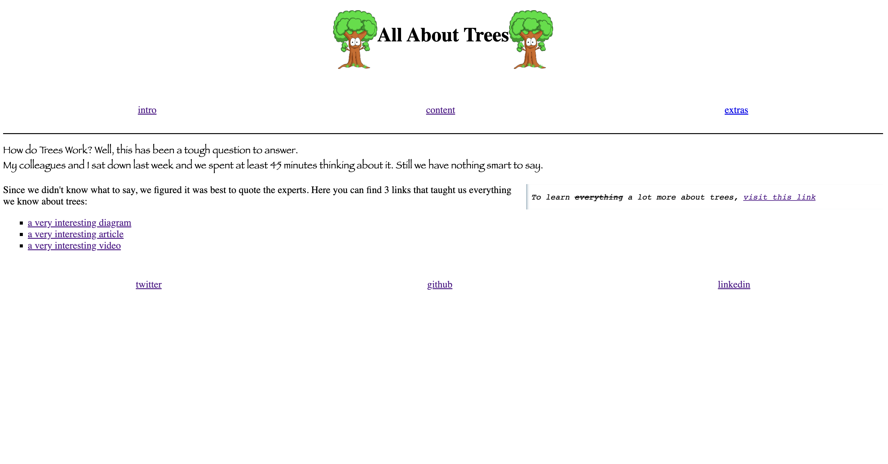
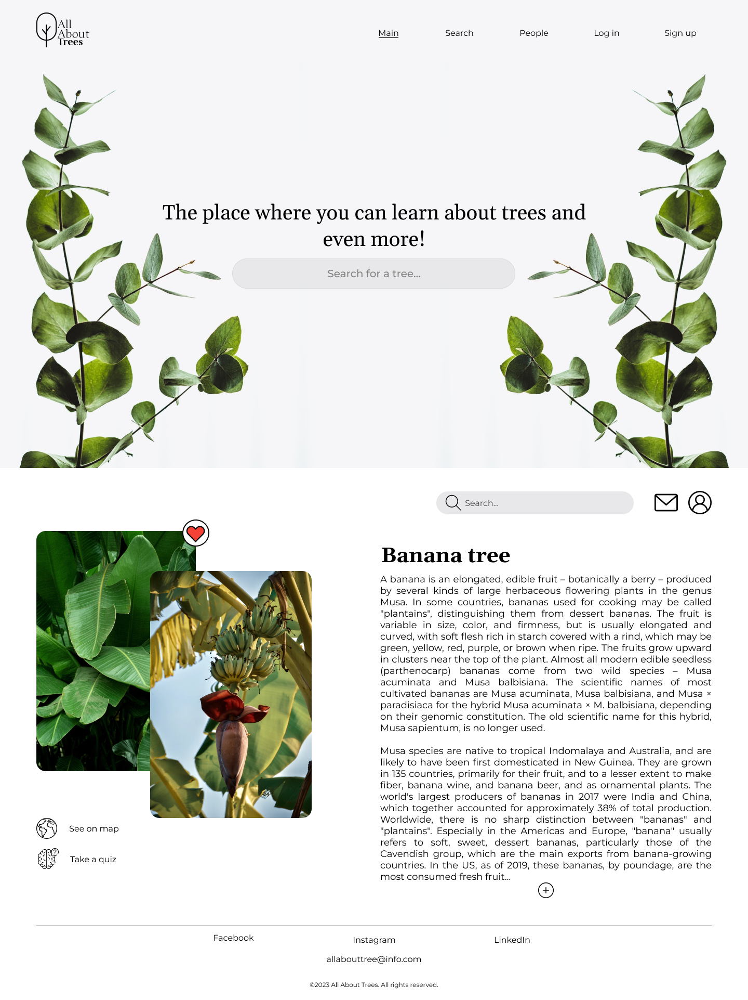

# All about trees

> A team collaborating project to gaining understanding and exercise Agile
> Development and to inform the people who are willing to focuses on it's
> importance of trees.</br> A website that focuses on the deep academical
> information about trees. It also included the exercises that can help you to
> reinforce the knowledge. And it is a place where users can find people with
> the same interest as well.

## Table of contents

- [Name of project](#name-of-project)
  - [Table of contents](#table-of-contents)
  - [General info](#general-info)
  - [Screenshots](#screenshots)
  - [Technologies](#technologies)
  - [Setup](#setup)
  - [Code Examples](#code-examples)
  - [Features](#features)
  - [Status](#status)
  - [Inspiration](#inspiration)
  - [Contact](#contact)
  - [Instructions for use](#instructions-for-use)
  - [Code Quality Checks](#code-quality-checks)
  - [Continuous Integration (CI)](#continuous-integration-ci)
  - [Repo Setup](#repo-setup)

## General info

[**CONSTRAINTS**](https://github.com/HYF-Class20/agile-development-group3-all-about-tree/blob/master/planning/constraints.md)
</br> Here you will find boundaries of our project</br>
[**COMMUNICATION**](https://github.com/HYF-Class20/agile-development-group3-all-about-tree/blob/master/planning/communication.md)
</br> Our team members have their own jobs/student. In here we explain our
timetable and schedules for meeting and availability to work as a team/group to
studying about the journey's end of the project</br>
[**USER-PERSONA**](https://github.com/HYF-Class20/agile-development-group3-all-about-tree/blob/master/planning/user-personas.md)
</br> In this section we created an imaginary bullseye spectator in order to
think avail their point of view.The imaginary spectator comes with their
interest of protecting the tree searching for solution of their to let people
know about the important role they have in nature.</br>
[**BACKLOG**](https://github.com/HYF-Class20/agile-development-group3-all-about-tree/blob/Backlog/planning/backlog.md)</br>
After creating user persona we carried out thinking as they do. we picked their
needs by classification; Must have, Should have, Could have.</br>
[**DESIGN**](https://github.com/HYF-Class20/agile-development-group3-all-about-tree/blob/Backlog/planning/design.md)</br>
We have priority and we are going to use this as base on our design for our
website. User-persona entirely done 🤝 Backlog entirely don as well 🏁 </br>
[**DEVELOPMENT STRATEGY**](https://github.com/HYF-Class20/agile-development-group3-all-about-tree/blob/master/planning/development-strategy.md)</br>
In this section it's based on the backlog and it is explain in our wireframe.
</br>
[**RETROSPECTIVE**](https://github.com/HYF-Class20/agile-development-group3-all-about-tree/blob/retrospective/planning/retrospective.md)
</br> This an abridgement feedback</br>

## Screenshots

 

## Technologies

- Agile
- Node 14.16.0
- VSC code
- HTML5
- CSS3
- Figma
- Markdown

## Setup

Template from HackYourFutureBelgium

- [Repository]
- Create a [project]
- Clone this [Repository]
- Add md files in planning folder directory
- start editing md files:

## Code Examples

```html
<!-- Navigation links  -->
<nav class="bottom-divider">
  <div class="spaced-items">
    <a href="#summary-info">intro</a>
    <a href="#main-info">content</a>
    <a href="#extra-info">extras</a>
  </div>
</nav>
```

## Features

List of features ready and Todos for future development

-
-
-

To-do list:

-
-

## Status

Project is: Done

## Inspiration

Project by freeCodeCamp.org

## Contact

- Nana
- Eben
- Takang
- Tesfalem

## Instructions for use

- Sign up for the new account or log in to existing one.
- Using search bar to find an information about a tree
- The user can save it
- The user can share the information with other users.
